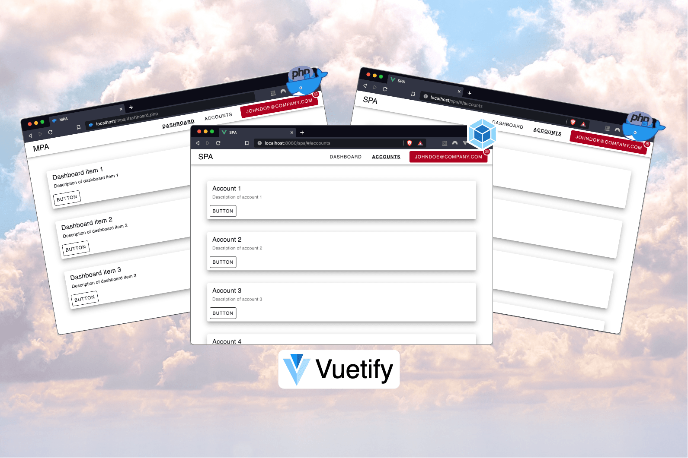

# [MPA SPA Hybrid](https://hendrikprinsloo.co.za/projects/mpa-spa-hybrid/)



**Multi-Page App + Single-Page App Hybrid** is an example application that is not meant as a kickstarter template. Reference the source code for an idea of how to migrate your legacy application to modern technology.

See this article for a detailed overview: [Migrate your Multi-Page Application to a Single-Page Application](https://medium.com/hendrikprinsza)
## Getting Started
### Dependencies
- Install Nodejs from [Nodejs Official Page](https://nodejs.org/en/)
- Install Composer from [Composer Official Page](https://getcomposer.org/download/) or [Homebrew Formulae](https://formulae.brew.sh/formula/composer)

### Development
**1. Clone the repo**
```
git clone https://github.com/HendrikPrinsZA/mpa-spa-hybrid.git
cd mpa-spa-hybrid
```
**2. Install NPM dependencies**
```
npm install
```
**3. Install the Composer dependencies**
```
cd live
composer install
```
**4. Launch the dev environment**
```
docker-compose up -d
npm run serve
```
**5. Access the environment via**
- http://localhost:8080/spa/ (Webpack devServer)
- http://localhost/ (Docker PHP Apache)

### Production
You can run `npm run build` and deploy the `/path/to/repo/live` directory to the web server.
## Demo
See the [Live Preview](https://hendrikprinsloo.co.za/projects/mpa-spa-hybrid/).